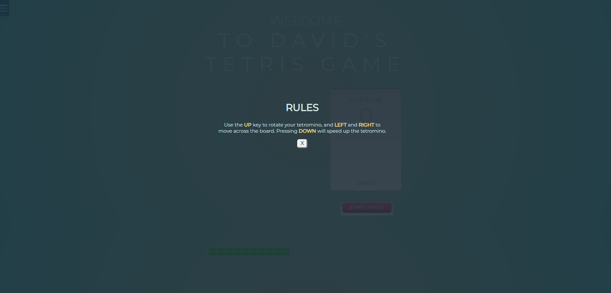
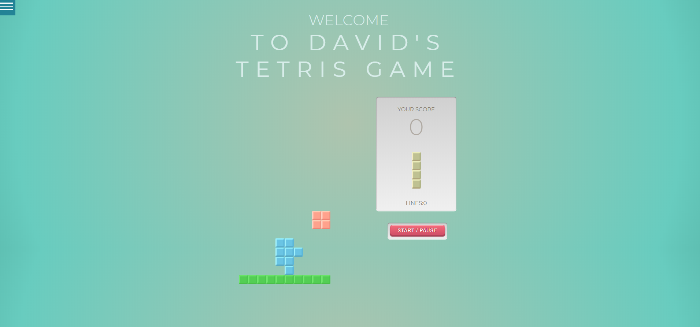

# Tetris

This is my Tetris game. I wrote this to practice my Javascript skills. I grew up playing Tetris and I wanted to see what went in to creating it. This was incredibly difficult and I'd like to thank Ania Kubow for her tutorial. I couldn't have done it without her

# Environment Setup

1. Clone my repo at https://github.com/davidmstanleyjr/Tetris
2. CD into it and right click and select "open in default browser" from the index.html.

# Technologies Used

1. HTML
2. Javascript
3. CSS
4. Google Fonts
5. Favicon.io

# Issues

I had trouble with this one from the start. Creating the grid was difficult because everything appeared all screwed up. Getting the shapes to rotate was tough as well. The randomly generating shape logic was tough as well. It was hard figuring out all that would have to go in to making it work and I wouldn't know where to start without a tutorial.

# Screenshots

# Live Page

Here is a link to the deployed site https://davidmstanleyjr.github.io/Tetris/

I hope you have fun with the game!